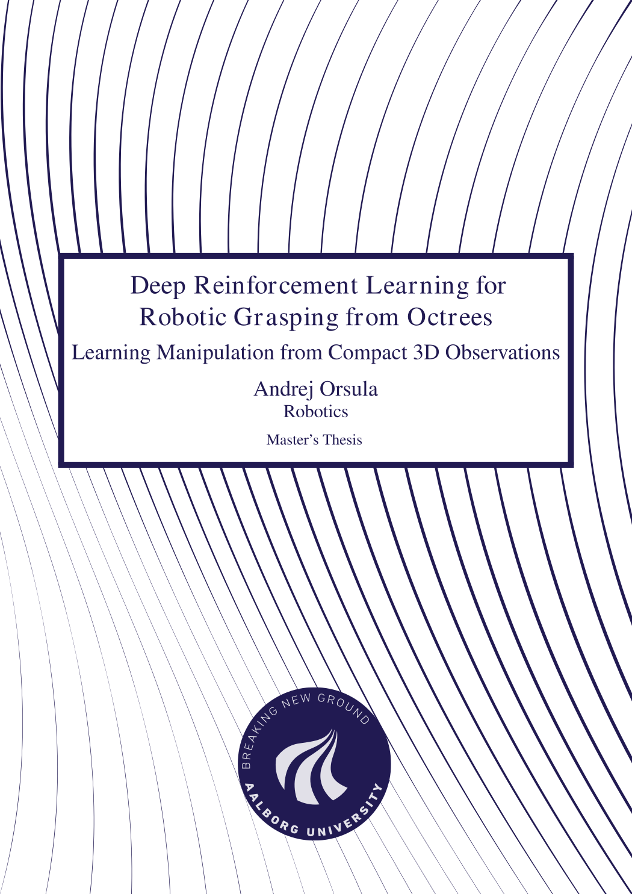

# Master's Thesis - Deep Reinforcement Learning for Robotic Grasping from Octrees

This repository contains LaTeX setup for my Master's Thesis conducted at Aalborg University, Denmark. If you are interested in the source code, please see [AndrejOrsula/drl_grasping](https://github.com/AndrejOrsula/drl_grasping).

Compiled PDF: [**master_thesis.pdf**](./master_thesis.pdf)

## Disclaimer (LaTeX Template)

Parts of frontmatter are adapted from [jkjaer/aauLatexTemplates](https://github.com/jkjaer/aauLatexTemplates) and modified for use with `memoir` class.
