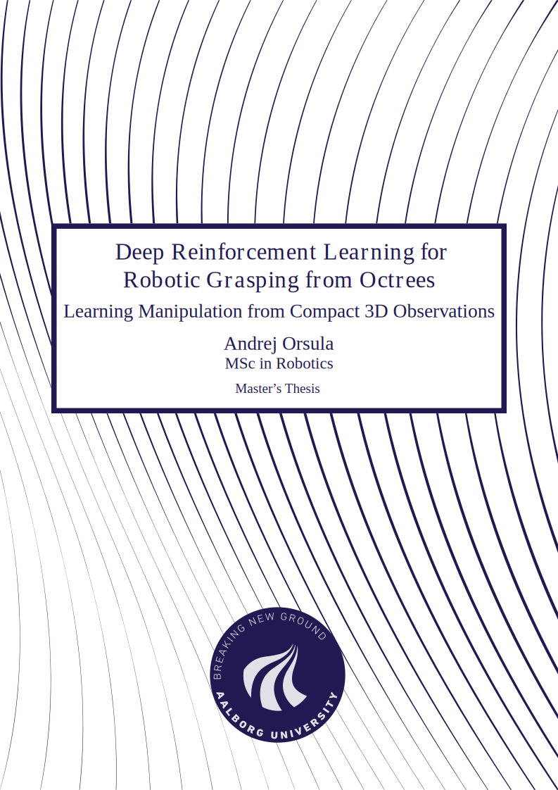

# Master's Thesis - Deep Reinforcement Learning for Robotic Grasping from Octrees

This repository contains LaTeX setup for my Master's Thesis conducted at Aalborg University, Denmark. If you are interested in the source code, please see [AndrejOrsula/drl_grasping](https://github.com/AndrejOrsula/drl_grasping).

Compiled PDF: [**master_thesis.pdf**](./master_thesis.pdf)

<a href="./master_thesis.pdf">
    
</a>

Accompanying recordings can be viewed under [YouTube playlist](https://youtube.com/playlist?list=PLzcIGFRbGF3Qr4XSzAjNwOMPaeDn5J6i1). Data acquired during experimental evaluation can be found inside [experimental_evaluation directory](./experimental_evaluation).

## Citation

```bibtex
@mastersthesis{orsula_deep_2021,
  author = {Andrej Orsula},
  title  = {{Deep} {Reinforcement} {Learning} for {Robotic} {Grasping} from {Octrees}},
  school = {Aalborg University},
  year   = {2021}
}
```

## Disclaimer (LaTeX Template)

Parts of frontmatter are adapted from [jkjaer/aauLatexTemplates](https://github.com/jkjaer/aauLatexTemplates) and modified for use with `memoir` class.
